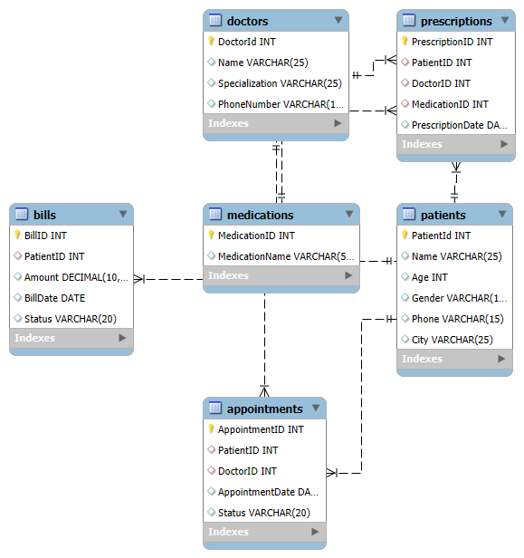

# 🏥 Hospital Management System - SQL Project

## 📌 Overview

This project contains a **Hospital Management System** database designed using MySQL. It helps manage patients, doctors, appointments, bills, medications, and prescriptions. The project includes database creation, sample data insertion, table relationships, an ER diagram, and 40 SQL queries to perform key operations and data analysis.

---

## 📂 Project Structure

```text
Hospital-Management-System-SQL-Project
│
├── 01_Create_Database.sql
├── 02_Insert_Data.sql
├── 03_SQL_Queries.sql
├── Hospital_ER_Diagram.png
├── SQL_Query_Outputs.pdf
└── README.md
```

---

## 🛠️ Technologies Used

- MySQL
- MySQL Workbench
- GitHub

---

## 🛠️ Setup Instructions

### 1️⃣ Prerequisites

- Install **MySQL Server** (Version 8.0 or above recommended)
- Install **MySQL Workbench**

### 2️⃣ Import the Database

To set up the database, follow these steps:

#### Using MySQL Workbench

1. Open **MySQL Workbench**.
2. Open **01_Create_Database.sql** and execute it to create the database and tables.
3. Open **02_Insert_Data.sql** and execute it to insert sample data.
4. Open **03_SQL_Queries.sql** and execute it to run all SQL queries.
   
#### Using MySQL Command Line

```sql
SOURCE 01_Create_Database.sql;
SOURCE 02_Insert_Data.sql;
SOURCE 03_SQL_Queries.sql;
```

---

## 🗄️ Database Schema

The database consists of the following six tables:

- Patients
- Doctors
- Appointments
- Bills
- Medications
- Prescriptions

The tables are connected using **Primary Keys** and **Foreign Keys** to maintain data integrity.

---

## 🗺️ ER Diagram



---

## 📊 SQL Concepts Used

- CREATE DATABASE
- CREATE TABLE
- INSERT INTO
- PRIMARY KEY
- FOREIGN KEY
- INNER JOIN
- Aggregate Functions
- GROUP BY
- HAVING
- ORDER BY
- LIMIT
- DISTINCT
- Subqueries
- Date Functions

---

## 📈 SQL Queries

### Beginner Level (15 Queries)

Includes queries related to:

- Patient Information
- Doctor Information
- Bills
- Appointments
- Medications
- Patient Search
- Doctor Search
- Appointment Status
- Billing Status
- Patient Details

### Intermediate Level (15 Queries)

Includes queries related to:

- Appointments per Doctor
- Appointments per Patient
- Total Bill Amount
- Latest Appointment
- Revenue Calculation
- Unpaid Bills
- Appointment Status Summary
- Average Bill
- Patients by Specialization
- Medications per Patient

### Advanced Level (10 Queries)

Includes queries related to:

- Top Doctors
- Monthly Billing Report
- Patients without Appointments
- Patients without Prescriptions
- Consecutive Appointments
- Doctor with Most Patients
- Total Unpaid Bills
- Patient Summary Report
  
**Total SQL Queries:** **40**

---

## 📄 Query Outputs

The outputs of all SQL queries are available in:

**SQL_Query_Outputs.pdf**

---

## 💡 Project Features

- Relational Database Design
- Hospital Data Management
- Six Interconnected Tables
- 40 SQL Queries
- ER Diagram
- Business Insight Queries

---

## 🎯 Learning Outcomes

Through this project, I learned:

- Database Design
- SQL Query Writing
- Primary & Foreign Keys
- Joins
- Aggregate Functions
- Subqueries
- Data Analysis using SQL

---

## 👩‍💻 Author

**Sujatha**

🎓 B.Tech – Computer Science & Engineering

### Skills

- SQL
- MySQL
- Database Design
- GitHub

**GitHub:** https://github.com/sujatham25
